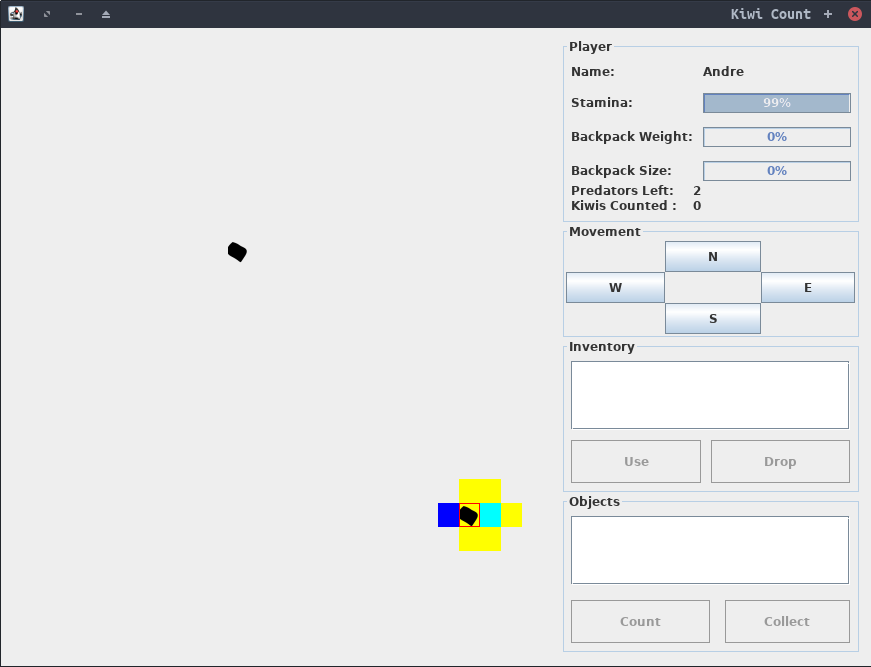
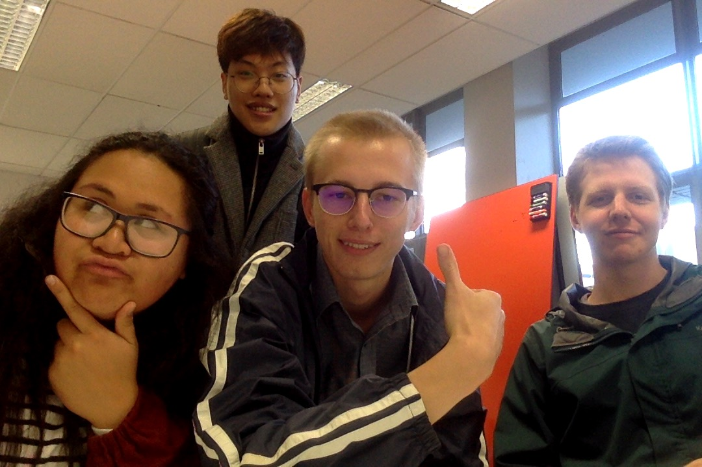

### [Home](./README.md) [Logbooks](./Logbooks) [Meetings](./Meetings.md)

- [Backlog](#backlog)
- [Acceptance Testing](#acceptance-testing)
  - [Features](#features)
    - [Introduction and Options screen](#introduction-and-options-screen)
    - [Upgrade of User Interface](#upgrade-of-user-interface)
    - [Random Occupants](#random-occupants)
    - [Vision Item](#vision-item)
    - [Predator Eradication](#predator-eradication)
    - [Predator Movement](#predator-movement)
    - [Predator Hunting](#predator-hunting)
    - [Difficulty Levels](#difficulty-levels)
    - [Game Introduction](#game-introduction)
   - [Failed Tests](#failed-unit-tests)
- [x] [Iteration 1](#iteration-one)
  - [Planning](#planning-1)
  - [Results Matrix](#results-matrix-1)
  - [Retrospective](#retrospective-1)
  - [Specific Feedback](#specific-feedback-1)
- [x] [Iteration 2](#iteration-two)
  - [Planning](#planning-2)
  - [Bugs](#bugs-2)
  - [Results](#results-matrix-2)
  - [Retrospective](#retrospective-2)
- [x] [Iteration 3](#iteration-three)
  - [Process Improvement](#process-improvement)
    - [Pair Programming](#team-programming)
    - [GitHub Documentation](#github-documentation)
  - [Planning](#planning-3)
    - [Items Remaining](#user-stories-and-remaining-tasks)
    - [Thoughts](#thoughts-for-iteration-three)
  - [Bugs](#bugs-3)
  - [Results Matrix](#results-matrix-3)
  - [Retrospective](#retrospective-3)
- [Evaluation of Process Improvements](#evaluation-of-process-improvements)
  - [Pair Programming](#team-programming)
  - [GitHub Documentation](#github-documentation)
- [Project Retrospective](#team-project-retrospective)

This document will look at the items that need to be completed for the project to be successful, in an as transperant agile way as possible. Given the process.

# Backlog
- Items
  - [x] As a player I want KiwiIsland to have an introduction and options before I play so that I have better understanding of why I should play Kiwi Island.
    - [x] Introduction Screen
    - [x] Information Screen
    - [x] Settings Screen
  - [x] As a player I want the GUI to have more visual appeal so that I can find the game more intricate and attractive when playing for longer periods of time.
    - [x] The Game has updated Iconsets
      - [x] The Game's terrain has updated visuals
      - [x] The Game's predators have updated visuals
      - [x] The Game's Players have updated visuals
      - [x] The Game's Kiwis have updated visuals
  - [x] As a player I want the kiwi island map and it's occupants to be laid out differently for each game so that the game has more replay value as well as being more immersive.
    - [x] Players spawn location is valid but random
    - [x] Kiwis spawn locations valid but random
    - [x] Predators spawn locations valid but random
    - [x] Tools spawn locations valid but random
    - [x] Hazard positions valid but random
  - [x] As a player I want to be able to see the area around me in the map so that I can be more strategic in terms of my map positioning.
    - [x] Vision Items Available
      - [x] Vision Items can be collected
      - [x] Vision Items can be used
      - [x] Vision Item when used Makes area visible
  - [x] As a user I want to be able to trap predators and to kill them so that they are removed from the current game.
    - [x] Make predators removed when trapped
  - [ ] As a player I want the predators in the game to be able to move around kiwi island so that there is a more interactive and challenging experience.
    - [ ] Predators can move
    - [ ] Predators can remove Kiwis if the Predator moves onto a Kiwis position.
    - [ ] Predators can damage a users Stamina if the user doesn't trap the predator and is on the same position as the
  - [ ] As a player I want the predators to be able to hunt both me, the player and the kiwis so that I have a sense of urgency to find all the kiwis quickly as well as the tool's to protect myself.
    - [ ] If A predator is in the vicinity of a Player or A Kiwi it will actively try to move towards it.
  - [x] As a player I want to be able to setup the size of the map before the game begins, so that the game can take more or less moves to complete.
    - [x] Input Width (Iter 1)
    - [x] Input Height (Iter 1)
    - [x] Map Size Scales (Iter 2)
  - [x] As a Player i want to have the ability to choose a difficulty level to make the game more immersive as well as replay value.
    - [x] Player can select Easy, Medium, Hard
    - [x] Difficulty setting impacts the number of Predators and the Predators Hunting Vicinity
  - [x] As a player I want to know an overview of how to play the game before I begin playing the game so that the game is more beginner friendly.
    - [x] Player told of Win Condition
    - [x] Player told of Lost Condition
    - [x] Goal of KiwiIsland

# Acceptance Testing

## Features

---
### Introduction and Options screen
---

| | |
|:-:|:-:|
|Scenario: | As a player I want Kiwi Island to have an introduction and options before I play so that I have a better understanding of why I should play Kiwi Island. |
|Given: | A window containing a title screen for kiwi-island, a quick information screen ("Could look into adding functionality like a quick tip for each different time that a player starts the game.") and then an options screen to customize the games dynamics. |
| When: | At the start of running KiwiIsland. |
| Then: | Move into your customized game with different sizes and difficulties. To find/count the kiwis and to hunt the predators|
| | |

---
### Upgrade of User Interface
---

| | |
|---|---|
|Scenario: | As a player I want the GUI to have more visual appeal so that I can find the game more intricate and attractive when playing for longer periods of time. |
|Given: | Throughout the game we hope to have improved icons of the map game view. Looking to overhaul the user interface to make it sleeker as well as inputs to allow the game to be played at a higher speed would be ideal for the replayability of the game.|
| When: |  In the main game as the player plays the game the map will be improved, from what the original fork of KiwiIsland looked like.|
| Then: | It would be possible to control the scale of the field of view of the camera to allow for a bigger map that you could explore more thoroughly with, this with and a sleeker new UI could make Kiwi Island more exciting for the player.|
| | |

---
### Random Occupants
---

|||
|---|---|
|Scenario: | As a player I want the kiwi island map and it's occupants to be laid out differently for each game so that the game has more replay value as well as being more immersive. |
|Given: | Random spawn locations of the occupants of the map including the player. |
| When: |  At the start of each game. |
| Then: | It would make the game have more replay value.|
| | |

---
### Vision Item
---

|||
|---|---|
|Scenario: | As a player I want to be able to see the area around me in the map so that I can be more strategic in terms of my map positioning. |
|Given: | The ability to locate vision items. |
| When: | When navigating kiwi island. |
| Then: | The player could expose parts of the map to enable them to be more strategic with their use of stamina. |
| | |

---
### Predator Eradication
---

|||
|---|---|
|Scenario: | As a user I want to be able to trap predators and to kill them so that they are removed from the current game. |
|Given: | Being notified that when their trap catches a predator that the predator was killed |
| When: | A trap is used on a predator  |
| Then: | The Player will be more rewarded for removing dangers to the kiwis. |
| | |

---
### Predator Movement
---

|||
|---|---|
|Scenario: | As a player I want the predators in the game to be able to move around kiwi island so that there is a more interactive and challenging experience. |
|Given: | Predators moving in the grid as the player moves|
| When: | The player chooses a direction for their next move |
| Then: | The game will be more interactive for the player. |
| | |

---
### Predator Hunting
---

|||
|---|---|
|Scenario: | As a player I want the predators to be able to hunt both me, the player and the kiwis so that I have a sense of urgency to find all the kiwis quickly as well as the tool's to protect myself. |
|Given: | Predators can remove Kiwis from game and also take the players stamina or kill the player. |
| When: | A predator is in the same location as a Kiwi or Player. |
| Then: | The game will be more difficult and will have an opposing role. |
| | |

---
### Difficulty Levels
---

|||
|---|---|
|Scenario: | As a Player i want to have the ability to choose a difficulty level to make the game more immersive as well as replay value. |
|Given: | A choice to choose a difficulty |
| When: | Before the game starts. |
| Then: | The game will have more or less occupants and the predators will have added speed. |
| | |

---
### Game Introduction
---

|||
|---|---|
|Scenario: | As a player I want to know an overview of how to play the game before I begin playing the game so that the game is more beginner friendly. |
|Given: | Basic information regarding what the goals of the Game are. |
| When: | Before the game begins |
| Then: | The player will have a better understanding of KiwiIsland and can enjoy the gameplay more. |
| | |

## Failed Unit Tests

Listed below are the unit tests that fail when run. The primary reason they seem to fail is that they were made with a set game board in mind. The old code base sets up a fixed game world with every item in the same spot. Perhaps in a later iteration we create more robust unit tests.

- testUseItemTrapFinalPredator Failed: check player moves
- testPlayerMoveFatalHazard caused an ERROR: invalid row for position (10)
- testPlayerMoveToInvalidPosition Failed: Move not valid
- testisPlayerMovePossibleValidMove Failed: Player should not have required stamina
- testPlayerMoveNotEnoughStamina Failed: This move invalid
- testCountKiwi Failed: This move valid
- testPlayerMoveNonFatalHazardNotDead Failed: Wrong stamina expected 47.0 but was 49

# Iteration One

### Planning 1

### Results Matrix 1
|Things for ITERATION 1| Result on Sunday 16th | User Stories Completed |
|---|---|---|
| Setup size of the map.| Fields have been added to accept a size of the map however funtionality will need to be changed in the Game object that was not completely forseen with the difficulty around the game being built by a text field.| "As a player I want to be able to setup the size of the map before the game begins, so that the game can take more or less moves to complete. Completed Input Width and Input Height but not Size of Map Scales"|
| Size of the map scales.| Plan to implement this over the next few days however i anticipate it will be a buggy affair| Unfortunately the user story was incomplete, it will move to iteration 2's backlog. This user story had three Acceptance Tests. We Completed two of the three in iteration 1|
| Give an overview of how to play the game on first run.| This as well as cleaning up how the game started was achieved. | "As a player I want KiwiIsland to have an introduction and options before I play so that I have better understanding of why I should play Kiwi Island."

### Retrospective 1

#### Andre
---
I am disappointed in our team's communication. We received a bad mark and we will need to work on our roles and expectations for this paper. I think we found the speed of this iterative approach for the portfolio very fast, especially given the time allocated with relation to all of our teams external commitments. While being our first project together I feel we can use these circumstances to improve our focus for the upcoming iterations to yield better results. I have been doing some work on the entry screen and contemplating the way to refactor or change the build flow of the game object. It is unscalable for KiwiIsland to be built by a single text file intertwined so tightly with the map and game. Passing the name through as I am doing with this commit is not the best change but it gives me the confidence to begin thinking about changing more of the initialiseIslandFromFile as well as providing a good branch point. I will continue to work on a new branch with a change in the games setup process. Looking especially into the setUpTerrain, setUpPlayer and potentially the setUpOccupants methods within the Game class.
#### Ben
---
We need to improve our teams communication, and have to make changes for more effective team meeting. Since we recieved a bad mark for our planning, we now know that our current team meeting strategy isnt working at the moment. Time management for everyone is required as everyone in this paper is focusing more on the Research and development paper.

#### Alex
---
The communication within the team has been poor. It seems that more team meetings should be held to enable each team member to see where the project is overall. We also need to structure our meetings better, we can identify what each team member is working, what obstacles are in the way and how to overcome them. I think problems from the iteration planning phase have propagated through to iteration 1 such as having developer stories as user stories. This may have lead to confusion and a lack of cohesion within the team. Unfortunately, I think this project had a low priority on everyone's 'to do' list and got overlooked.

#### Ete
---
The team communication has been not as good as we wanted and that there were times where  miscomunnication arose. Also we even need more meetings to help each other understand what is happeing in the process of the kiwi island program. But we also prioritsed other papers then this one which is why we didn't spend as much time on it . 

#### Overall
---
Our team didn't spend enough time together and on the project. We also failed to meet the assignment spec. Going forward we will address these issues by setting more time for meetings. Completing more work. Making sure the work meets the courses guidelines. And clearly documenting our process with an improved system.

### Specific Feedback 1
Clear table of contents of deliverables.
Acceptance tests for all User Stories.
Improve Commit Messages.
More Software Added.
Text Wrapping Of Information Screen Could be Improved.

# Iteration Two

#### Planning 2

The tasks we wish to achieve in iteration 2 are outlined below.

- [x] Dynamic map (L)
  As a User, I want the map to be different on each play, so that each game is unique.
  As a User, I want to be able to set the size of the map, so that each game

- [x] Difficulty Levels
  Impact the number occupants in the game

- [x] Semi Random Terrain (M)
  As a User, I want the map to represent a Island but to have differing

- [x] Random Spawn Location of Player, Predator, Traps/Hazards and Objects (XL)

- [ ] Icons for occupants (M)

- [x] Icons for player (S) (Note need to improve the png.)

- [ ] Improved rendering for terrains (M)

### Meeting 4/05

Ben is working on overhauling the UI to replace the Strings that represent the terrain. His changes will impact the ability for the code to run in the short term. He will create new branch while he works on this task.

We plan for the short term to keep the text file, Andre and Alex will look at manipulating the text file to enable the map to be more dynamic. They will work on devInitChange branch.

## Bugs 2

Description | Reproduced By |Solved (How) | When
--- | --- | --- | ---
Size of map width and height, could not be changed with keyboard | Putting numbers into width height field with keyboard would not register in the JSpinner commit with bug: 251b4d5 | Changing the JSpinner model from a List Model, to a NumberModel commit: e304247 | 7th May
Text on the Information Screen is wrapping unnecassarily | The text always wraps |Making the pregame Jframe larger | 10th May
Ability to have JLabel icons as the icons for the occupants and terrain | You can only have one icon in a JLabel not two, making it required for the images of the player, the terrain and the occupants to be merged prior to updating the GridSquare Panel | Discussed in iteration 3 bugs. | Solved in the third iteration.
 | A current bug regarding the basic png for the player that on death and game reload causes this issue. | Discussed in iteration 3 bugs. | Solved in the third iteration.

### Results Matrix 2

|Things for ITERATION 2| Result on Sunday 14th | User Stories Completed |
|---|---|---|
| Dynamic Map | Completed to a nice standard. Will now change with every game. Can also scale the map. | As a player I want to be able to setup the size of the map before the game begins, so that the game can take more or less moves to complete. |
| Difficulty Levels | Completed could be improved, difficulties make the number of occupants change. Will look to make the difficulties impact the predators movement in the next iteration. | As a Player i want to have the ability to choose a difficulty level to make the game more immersive as well as replay value.|
| Semi Random Terrain | Completed and is working well so that the map will generally resemble an island but is prone to randomness too. | As a player I want the kiwi island map and it's occupants to be laid out differently for each game so that the game has more replay value as well as being more immersive. |
| Random Spawn Locations | Completed the players and all occupants are generated with randomness| As a player I want the kiwi island map and it's occupants to be laid out differently for each game so that the game has more replay value as well as being more immersive.  |
| Icons for Occupants | Incomplete. | As a player I want the GUI to have more visual appeal so that I can find the game more intricate and attractive when playing for longer periods of time. |
| Icons for Player | Semi Complete. Able to make the player icon render need to improve the icon and maybe give the player a choice of female and male icon. | As a player I want the GUI to have more visual appeal so that I can find the game more intricate and attractive when playing for longer periods of time. |
| Icons for Terrain | Incomplete. Have some icons. Code does not work at the moment, and is in fix. No one has added them to the code to make them render... | As a player I want the GUI to have more visual appeal so that I can find the game more intricate and attractive when playing for longer periods of time. |

### Retrospective 2

#### Andre
We need to collaborate and communicate more. We have come to the realisation that we will need to utilize techniques like pair programming. We improved from the first iteration but there is definetly more room for improvement. We have improved our communication and we are all trying to 'commit' more than the first iteration. We will need to focus as a team on managing our own expectations and working well together to deliver a more elegant product. With this iteration we worked slowly through the week on documentation, meetings, and with inconsistent digital communication. But now at the end, this weekend is turning things around and we are trying to work well on delivering a good commit.

#### Ben
More meetings, and more work done by the team compared to Iteration 1. However It could be improved by more. I also learnt how to use github properly and try not to use local repository too much and keep committing to the github. For final iteration I believe we can spend more time for SE - setting dedicated team meetings, and allowing everyone to work on the project so we can lessen our burden on each other.

#### Alex
As I see it, the primary problem for the inconsistency in this project is due to a lack of time needed to gather and coordinate the team. The team seems to steer off course quickly as we all have other commitments. There was more work done towards this project by the team but I think we were just as fractured as we were before. Communication seems to have marginally improved but are still not frequent enough to steer the team in the right direction.
The project does not have a clearly defined goal other than to add features, decided by the development team. I think this demotivates the team and does not provide any impetus to really get things done.

#### Ete
Need to put more work towards this becasue this but we are slightly improving. I think that after the feedback from the Iteration 1 we manage to solve some problems we had in the last Iteration. Also there was a change in the one note to Github. Which is useful because the use of one note was frustrating for me to use. Our communication improved more and we have all understood what is needed to be done.  

# Iteration Three

## Process Improvement
We have identified two processes which can improve our teams output and collaboration.

### Team Programming
We plan to set aside two days of the week for pair programming. The times will be after the Thursday lecture at 5:00pm and on Sunday evenings within 7:30pm and 8:30pm. We think this will be an effective method of collaborating together. We will measure this by documenting the outcomes and the hours spent of each pair programming session. The Thursday meeting will be in person, and the Sunday evening meetings will be done digital via a facebook group call.

[Pair Programming Table](./Meetings.md)

### GitHub Documentation
From iteration 2 we have moved our documentation from MS OneNote and Planner to GitHub. This allowed better collaboration compared with iteration 1. The team has better control of the documents. We can also have two members working on the same document while working on seperate components of the document and then use the merge functionality to keep both member's additions.

## Planning 3
### User Stories and Remaining Tasks
  - [x] As a player I want the GUI to have more visual appeal so that I can find the game more intricate and attractive when playing for longer periods of time.
    - [x] The Game has updated Iconsets
      - [x] The Game's terrain has updated visuals
      - [x] The Game's predators have updated visuals
      - [x] The Game's Players have updated visuals
      - [x] The Game's Kiwis have updated visuals
        - [x] As a player I want to be able to see the area around me in the map so that I can be more strategic in terms of my map positioning.
    - [x] Vision Items Available
      - [x] Vision Items can be collected
      - [x] Vision Items can be used
      - [x] Vision Item when used Makes area visible
  - [x] As a user I want to be able to trap predators and to kill them so that they are removed from the current game.
    - [x] Make predators removed when trapped
  - [ ] As a player I want the predators in the game to be able to move around kiwi island so that there is a more interactive and challenging experience.
    - [ ] Predators can move
    - [ ] Predators can remove Kiwis if the Predator moves onto a Kiwis position.
    - [ ] Predators can damage a users Stamina if the user doesn't trap the predator and is on the same position as the
  - [ ] As a player I want the predators to be able to hunt both me, the player and the kiwis so that I have a sense of urgency to find all the kiwis quickly as well as the tool's to protect myself.
    - [ ] If A predator is in the vicinity of a Player or A Kiwi it will actively try to move towards it.
    - [ ] Improved rendering for terrains (M)

### Thoughts for Iteration Three
From the user stories above, there will be more work done on the user interface. There problems with getting the grid square and icons implememted. We have a lot of icons for kiwis, predators, traps, etc but implementing them has been more time-consuming that previously thought.
We want the predators to be able to move around the map and perhaps stalk the player or eat / kill the kiwis. About a third of the user stories will be put into this iteration.

## Bugs 3

Description | Reproduced By |Solved (How) | When
--- | --- | --- | ---
Ability to have JLabel icons as the icons for the occupants and terrain | You can only have one icon in a JLabel not two, making it required for the images of the player, the terrain and the occupants to be merged prior to updating the GridSquare Panel | We have solved this issue by making the game screen fixed size. Making the game fixed size allows for the iconsets we designed to be rendered in their natural ratio. | 1st June Meeting/Mobbing
 | A current bug regarding the basic png for the player that on death and game reload causes this issue. | We have fixed this issue by discussing a new piece of functionality for an endgame display. This will allow us to display (department of) conversation resources. As well as give users a post game feeling. | Discussed on the 18th Mobbing.
Game loading very slowly not being able to update. | This was a technical challenge we faced with the grid square panel class. We would be trying to customize the class to change the graphics, however the way we would use jlabel icons would slow the game down. | We looked to create an image loading class to make the icons load smoothly. | 1st June Meeting/Mobbing.
End Game | Wouldn't open when the game was over and would cause the game to close. | We added an endgame to solve our bug relating to the instant new game at the end of a previous game. This gives the user that ability to choose  to play a new game or view important conservation websites. The problem was solved by making the endgame it's own new Jframe. | 1st June

### Results Matrix 3

|Things for ITERATION 3| Result on Sunday 4th | User Stories Completed |
|---|---|---|
| Icons for Occupants | Complete, all different types of occupants now have their own images. When occupants that can be collected are collected they are removed from the map | As a player I want the GUI to have more visual appeal so that I can find the game more intricate and attractive when playing for longer periods of time. |
| Icons for Player | Complete, the player will icon will work with both occupant and terrain icons. | As a player I want the GUI to have more visual appeal so that I can find the game more intricate and attractive when playing for longer periods of time. |
| Icons for Terrain | Complete, the terrain icons no have a layer of depth and also have the ability to render players and occupants onto the terrain. | As a player I want the GUI to have more visual appeal so that I can find the game more intricate and attractive when playing for longer periods of time. |
| Predators Killed on Trap | Complete, thanks to the logic Andre did with the icons. The predator icon will be removed when a predator is trapped. |  As a user I want to be able to trap predators and to kill them so that they are removed from the current game. | 
| Vision Item | Have added binocular items to the game. This enables the player to gain vision around them when they use the binoculars. | As a player I want to be able to see the area around me in the map so that I can be more strategic in terms of my map positioning. |
| Predators Moving | | |

### Retrospective 3

#### Andre
The final iteration showed a continuing improvement from both the second and first iteration. We meet more frequently and worked together to better understand the product we where adding to. I believe the team begun to enter a performing stage of the tuckerman stages of team development. We had difficulties allocating time at the start of the iteration due to other papers having earlier due dates, but our meetings helped resolve this by keeping Team xD fresh in all of our minds. I feel that this was a good final iteration for both myself and the team, as we where able to refine our process and work more collaboratively.

#### Ben

#### Alex
The final iteration of the project saw a project team that was more focused and was able to get tasks completed within a more timely manner. Laying out a foundation after the close of iteration 2 on what we did well and more importantly, what we needed to improve on was something that helped us greatly. After the close of iteration 1, we did try some different planning techniques but we did not layout a strategy. I think we learned from this after iteration 2 and developed a plan and stuck to it. We decided to increase the frequency of out meetings to twice a week. One meeting was during the week in person and the other was done digitally via a Facebook group call. The digital meeting enable us to be more flexible as we did not need to be on AUT grounds to meet. Meeting twice a week worked well as we were able to keep track of where the project was tracking how each individaul team member was doing. Other commitments such as other papers and slowed us down but this was easier to manage with more frequent meetings. I think overall, identifying our failings in other iterations and acting on improving them filtered down into a higher quality output.

#### Ete

## Evaluation of Process Improvements

### Team Programming
The Mob/Pair Programming we did was definitely a big improvement to the teams collaboration. We spent most of this time together going over the code we added as well as addressing classes that needed to refactored or improved. We would say that we used this time more for code review purposes than actually adding code. However it helped the team identify troublesome parts of our solution and draft plans to fix them. In particular with the icon issues we faced with our graphical changes. 
This was measured in the number of team meetings/mob programming time we spent together. The time spent shows that as a team we where able to collaborate and discuss kiwiisland more as a team. Overall, we think that the use of mob/pair programming has improved the overall quality of our code as other members are able to spot faults or point out areas of improvement.

### Github Documentation
Working on github to do our documentation was a big improvement for the team. It allowed us to review one another's changes to the document. Work on this document in unison and then merge our work. Github also was a lot faster and less bloated than using MS One Note and it allowed the project to be present in a single place. We should have looked to utilize more features of github like the wiki or issues. These features may have allowed us flag code issues more clearly to other team members then they could attempt to resolve the issues at their leisure. But as it was many of the team's first real time using git and github working with markdown files was enough of a learning curve for creating clean documentation. The level of our documentation from all of our iterations compared to what we had in onenote for our first iteration shows clearly that this process improvement made a big impact in how the team was able to work on this project.

## Team Project Retrospective
The team formed in the first Software Engineering lab. We all beginning working together at the start of the project in the labs. We began going through a norming phase in our first iteration as we grew more familiar with one another. Unfortunately as we where not familiar with one another's strengths and weaknesses it was difficult for the team to add much value to the product in the first iteration. However the team kept communication channels open and went through a bit of a storming phase (See Tuckman's stages of group development) once the iteration 1 results where released. 

We then begin to move into a performing stage and changed our process for documentation out of OneNote to GitHub. This drastically improved the team's ability to collaborate and improve the illustration of the team's process. With this change our second iteration produced a lot more value to the product and also helped the team work together on the project. The big outcome of having a dynamic map was delivered in this iteration. 

In our final iteration the team decided to spend time together working on and reviewing the code. This improved the team's collaboration even more and helped all of the team discuss the implementation of the proposed features and how they could be added into the final product. This third iteration's process improvement really defined the result of the project for the team and made us produce a much improved version of kiwi island. We also all learned valuable skills particularly in this final iteration relating to code review, code collaboration and communicating our ideas of different implementation strategies. We started to see the dividends of our process improvements. 

Overall the team formed with members that had never meet or worked together and we where able to refine our process over our iterations. The first iteration we had difficulties understanding the goals of the project and what was the expected output for the team. In the second iteration we clearly improved our process and spent more time producing documentation of our teams process and in the final iteration we improved our collaboration by meeting more regularly and discussing more critically the goals of our project. If the team was required to work together on another project we believe we could produce an improved result as we now know each other's strengths and weaknesses, how meetings work the best for us and we know how to be the most productive as we can be as a team. It has been a pleasure working in this team as we have made new friendships with one another and where able to identify areas where both individuals and the team as a whole needed to improve. 

Team xD!

